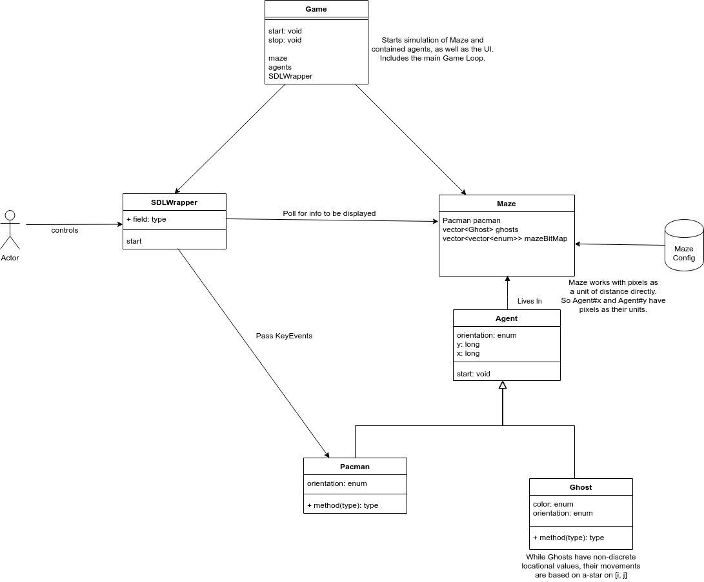

# pacman

A pacman game implemented in C++.
*cmake file for importing SDL2-Images taken from <https://trenki2.github.io/blog/2017/07/04/using-sdl2-image-with-cmake/.>*

## Overview

This project is a simple pacman game. It creates a game based on pre-created game configurations that specify maze configuration, number of position of pacman and the ghosts, etc.
To play the game, simply use the arrow keys to move Pacman around the maze.

- If Pacman eats all pellets in the maze, he wins!
- If a ghost catches Pacman, the ghosts win.
- To quit the game, press 'Esc' or the 'X' button.

Once either happens, the outcome of the game is printed to the terminal.

### Game Orchestration

The main orchestrator of the game is the `Game` class.
Upon initialization, this class instantiates the major components of the class, based on the above-mentioned game configurations. These components (which is owned by `Game`) include

- `Pacman`
- `Ghost`s
- `Maze`
- `SDLWrapper`

`Game` also contains the main Game Loop, which is started upon call to `Game#start` and stopped upon call to `Game#stop`.
The game logic all take place concurrently. Therefore, this Game Loop only consists of processing user input, and displaying current game state through the `SDLWrapper` (more on that below).

### Game Logic

The game logic is implemented by `Maze` and the `Agent`s (`Pacman` and the `Ghost`s). Each of the agents are initialized within `Game` within their own threads, and make movements dictated by each agent's own logic, as well as the validity of a move (as determined by `Maze`).

- `Pacman` simply attempts to move in the direction that the user specifies, based on input from `SDLWrapper`.
- `Ghost` has a weak reference to Pacman, which it uses to perform an A* search to determine the best course of action to chase down Pacman.

The `Maze` contains the internal representation of the pre-created maze (A 2-D vector), and offers convenience methods for the contained agents to use.
When any of the agents detect their victory (ghosts captured Pacman, or Pacman ate all pellets), they call back on `Game#stop` with a reason.

### User Interface

The UI is implemented by SDL2 (Simple DirectMedia Layer 2). `SDLWrapper` simply wraps around the SDL2 library and

- Takes in user inputs. This includes controlling Pacman, as well as quitting the game.
- Renders the current state of the game.

## Architectural Diagram

## Note on Project File Structure

Due to the small number of simple, discrete components, this project has a completely flat src folder.

## Building the Program

1. (If needed) Install sdl-2-dev via `apt install libsdl2-dev`
1. Install sdl2-image-dev via `apt install libsdl2-image-dev`
1. From within top-level `pacman` directory: `mkdir build && cd build`
1. `cmake ..`
1. `make`

## Running the Program

1. From within `pacman/build`: `./pacman <game-config>`, where `<game-config>` is a number between 1 to 5 (inclusive) corresponding to different available game configurations. If no game-config is specified, the program defaults to game-config 5.

## Rubric Points Addressed

1. Critera [The project reads data from a file and process the data, or the program writes data to a file.]: In `pacman::Maze::readMazeMatrix` (line 89 of Maze.cpp), I read a maze configuration from a file to reify it into a maze object.
1. Criteria [The project accepts user input and processes the input.]: In `pacman::SDLWrapper::processInputEvents` (line 71 of SDLWrapper.cpp), I take in user key inputs to trigger different actions (ie Stop the game, move Pacman).
1. Criteria [The project uses Object Oriented Programming techniques.]: I've contained appropriate game logic into different classes:
    - `Game` Game Orchestration.
    - `Pacman` The user-controller pacman agent of type `Agent`.
    - `Ghost` Another `Agent` that chases Pacman.
    - `Maze` Contains internal representation of maze, and provides methods surrounding maze (eg validity of agent move within maze).
    - `SDLWrapper` Contains all User interface (both input and output) logic.
1. Criteria [The project uses smart pointers instead of raw pointers.]: No instances of raw pointers in project. `Game` (owner of Maze, SDLWrapper, Pacman, and Ghosts) reference these with appropriate smart pointers (line 63 of Game.h). Components requiring non-owning references to other components are given such references as appropriate std::weak_ptrs. Example available in SDLWrapper initialization (line 19 of SDLWrapper.h).
1. Criteria [The project uses multithreading.]: All agents execute their continuous game concurrently (though not necessarily on different hardware threads) at pacman::Game::start (line 32 in Game.cpp).
